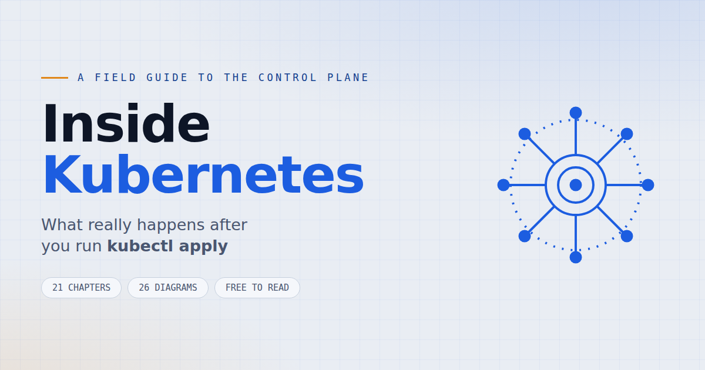

<div align="center">



### What really happens after you run `kubectl apply`?

**[📖 Read it online](https://k8s.ivymurage.com)** &nbsp;·&nbsp; **[📕 Download the PDF](https://k8s.ivymurage.com/inside-kubernetes.pdf)** *(164 pages)*


</div>

---

## Why this guide exists

Most Kubernetes tutorials teach you the components **one at a time**. You learn that
Deployments manage ReplicaSets, that the Scheduler assigns Pods to nodes, that the
Kubelet starts containers — and you can define each of them in isolation.

Then someone asks a simple question:

> *"What actually happens after you run `kubectl apply`?"*

…and the individual definitions don't add up to an answer.

**This guide takes a different approach.** Instead of studying Kubernetes as a
collection of independent parts, we follow **one single Deployment** — from the moment
it leaves your terminal until a client receives a response from the running
application. Every major component performs its role, then hands responsibility to
the next.

The goal isn't to memorize Kubernetes. It's to understand **how it thinks**.

---

## Who it's for

- **Software engineers** deploying applications to Kubernetes
- **DevOps engineers** managing clusters
- **SREs** operating production workloads
- **Platform engineers** building internal developer platforms
- **Students** preparing for certifications or interviews

You don't need to be an expert. If you've written a Deployment before and know
roughly what a Pod is, you have everything you need.

---

## The journey

```
kubectl apply → API Server → Authentication → Authorization → Admission Controllers
    → etcd → Deployment Controller → ReplicaSet → Pods → Scheduler → Worker Node
    → Kubelet → Container Runtime → Running Application → Service → EndpointSlice
    → kube-proxy → Client Request → Response
```

Every chapter is one station on that path.

---

## Contents

| Part | Chapters |
|---|---|
| **I — The Journey Begins** | What Really Happens When You Run `kubectl apply`? |
| **II — Entering the Cluster** | The API Server · etcd: The Source of Truth |
| **III — Kubernetes Starts Working** | Understanding Controllers · The Deployment Controller · ReplicaSets |
| **IV — Scheduling Workloads** | Pods Waiting for a Home · The Scheduler · The Kubelet · Container Runtimes |
| **V — Making Your App Reachable** | The Problem with Pod IPs · Services · EndpointSlices · kube-proxy · Headless Services |
| **VI — Self-Healing & Rolling Updates** | Rolling Updates · Kubernetes Never Stops Watching |
| **VII — Establishing Trust** | Trust Between Components · Client & Server Certificates · kubeconfig |
| **VIII — Bringing It Together** | Following One Deployment From Start to Finish |

Plus a **Production Debugging Guide**, a **Component Reference**, and **Appendices A–E**.

---

## Jump straight to a chapter

The reader supports deep links — handy for sharing a single answer:

| Link | Topic |
|---|---|
| [`/#ch7`](https://k8s.ivymurage.com/#ch7) | Why is my Pod stuck in `Pending`? |
| [`/#ch8`](https://k8s.ivymurage.com/#ch8) | How the Scheduler picks a node |
| [`/#ch13`](https://k8s.ivymurage.com/#ch13) | EndpointSlices — why `Endpoints: <none>` |
| [`/#ch14`](https://k8s.ivymurage.com/#ch14) | kube-proxy, iptables, and IPVS |
| [`/#ch16`](https://k8s.ivymurage.com/#ch16) | Rolling updates & zero-downtime deploys |
| [`/#debugging`](https://k8s.ivymurage.com/#debugging) | **Production Debugging Guide** |
| [`/#reference`](https://k8s.ivymurage.com/#reference) | Every component at a glance |

---

## Ten misconceptions this guide corrects

| ❌ Myth | ✅ Reality |
|---|---|
| Deployments create Pods directly | Deployments create ReplicaSets; ReplicaSets create Pod objects |
| Kubernetes constantly polls the cluster | It's event-driven, via the Watch API |
| kube-proxy creates Pod networking | The **CNI plugin** does; kube-proxy handles Service traffic |
| Services own Pods | Services *discover* Pods using label selectors |
| Kubernetes runs containers | It delegates to a Container Runtime through the CRI |
| The Scheduler starts Pods | It only *assigns* them; the Kubelet starts them |

…and four more inside.

---

## Running it locally

It's a single self-contained HTML file — no build step, no dependencies.

```bash
git clone https://github.com/<you>/inside-kubernetes.git
cd inside-kubernetes
open index.html          # macOS
# xdg-open index.html    # Linux
```

Fonts and diagrams are embedded, so it works **fully offline**.

---

## Repository layout

```
index.html                 # the book (self-contained: fonts + diagrams inlined)
inside-kubernetes.pdf      # 164-page print edition
og-image.png               # social preview card
favicon.png
robots.txt · sitemap.xml
```

---

## Contributing

Found a technical error, a typo, or a diagram that could be clearer?
**[Open an issue](../../issues)** — corrections are genuinely welcome.

If you're proposing a change to the text, quote the chapter and section so it's
easy to locate.

---

## License

Released under **[CC BY-NC-SA 4.0](https://creativecommons.org/licenses/by-nc-sa/4.0/)**.

You're free to share and adapt it with attribution, for non-commercial use.

---

<div align="center">

*"Kubernetes doesn't execute commands. It reconciles desired state."*

**[Start reading →](https://k8s.ivymurage.com)**

</div>
